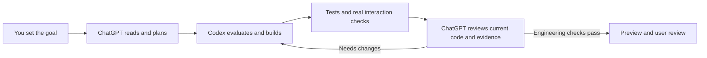

# Silas GPT Codex Orchestrator

English | [简体中文](README.zh-CN.md)

**ChatGPT helps plan and review. Codex builds and verifies. You decide whether it works.**

Turn a small idea into something you can actually try. Describe the goal to Codex; this skill organizes the conversation with ChatGPT, tracks the current project and evidence, and brings the result back for your review. Connection services run on demand.

[What it does](#what-it-does) · [Why use both](#why-use-both) · [Install](#install-with-one-prompt) · [First project](#start-your-first-project) · [FAQ](#faq) · [Technical docs](#technical-docs)

> Early release. A complete live MCP workflow has been exercised on macOS in the Codex desktop environment. Account eligibility, installation, and other platforms still require checks in your own environment.

## What it does

This skill provides a repeatable process for planning, implementation, verification, and review around a real local project.

| Participant | Role in this workflow |
|---|---|
| You | Set the goal, choose the project and sharing scope, try the result |
| ChatGPT | Read authorized project material, propose a plan, review changes and evidence |
| Codex | Evaluate the plan, edit files, run checks, operate previews, and relay messages |

Codex can plan and review too. These are workflow roles, not a ranking of models. Keep your preferred model; the skill does not require a particular model version or two different models.

Use it for a small website, one feature in an existing project, a reproducible bug, or an iteration based on real feedback. A good first request is: “Build a task tracker that keeps my progress after a refresh.”

## Why use both?

**Less copying between tools, with another review of the actual result.**

| Approach | Best suited to | Practical difference |
|---|---|---|
| A regular ChatGPT conversation | Ideas, requirements, and tradeoffs | Without execution tools, you implement the plan and return the results |
| Codex alone | Direct edits, debugging, routine development | Fewer steps; it can plan, execute, and review by itself |
| This skill | Work worth discussing, building, and reviewing in several rounds | Codex relays messages while ChatGPT reads the current project and matching evidence |

The workflow reduces manual handoffs, gives ChatGPT a separate review context, and ties plans and reviews to the task and code version. A shared interface makes it easier to follow discussions and previews. The connection makes the agents communicate; two windows placed side by side do not.

Setup and extra review add time and model usage. For a wording change or a clear small fix, Codex alone is usually simpler. Both agents may share a blind spot, so real tests and your feedback still matter.

## Install with one prompt

You do not need to learn terminal commands first. Paste this into Codex and let it guide the setup. You may still need to log in or approve project access.

```text
Please install and configure Silas GPT Codex Orchestrator from https://github.com/SilasMaker/silas-gpt-codex-orchestrator. I am new to this. Handle the steps you can automate and explain progress in plain English.

1. Read the skill instructions and check my environment, existing installation, and connections. Prepare the required dependencies, reuse working tools, and preserve my local changes. Do not buy services or upgrade subscriptions automatically.
2. Install the complete silas-gpt-codex-orchestrator folder into the skills directory used by my Codex environment, including references, scripts, and runtime source. Do not copy only SKILL.md. Build the runtime as documented and check that Codex can read the skill. Tell me if I need to reload or start a new conversation.
3. Briefly explain what the skill does. Use a separate test project containing no private information for the first connection, and let ChatGPT read only that project.
4. Follow the included connection guide and choose a supported method for my actual account and environment. Use the Codex in-app browser when available. If I need to log in, enter a verification code, or authorize access, give me one necessary action at a time. Keep passwords and keys in the appropriate webpage or private local configuration, never in chat.
5. Have ChatGPT read a test file, change it to a new value that you do not reveal in the message, and have ChatGPT read it again. Compare the results to verify a live connection. If blocked, explain the specific issue and preserve progress; do not present a simulation or manual relay as an automatic connection.
6. Finish with a short checklist: skill installed and readable, ChatGPT connection verified, checks passed, anything I need to handle, and a copyable prompt for my first small project. Stop connection services started for this test when finished.

```

### Manual installation

1. Download or clone this repository.
2. Place the complete `silas-gpt-codex-orchestrator/` folder in your Codex skills directory, commonly `~/.codex/skills/`. Use your actual configured directory and preserve local changes if a version already exists.
3. Ask Codex to read the skill and follow the [connection guide](silas-gpt-codex-orchestrator/references/connection.md) to prepare dependencies, build the runtime, and verify the connection. Reload or start a new conversation if your environment requires it to discover a new skill.

Copying only `SKILL.md` is not enough. Installation alone does not create a project, launch a welcome message, or connect ChatGPT.

## Start your first project

```text
Use $silas-gpt-codex-orchestrator. This is my first time. Explain what it does and check what I still need. Once connected, help me create a separate task-progress demo: check off tasks, show progress, and keep it after a page refresh. Build one small usable version, then give me a preview and actual check results.
```

Codex should first explain what is ready and what still needs checking. Existing goals and permissions carry forward; login or a new sharing decision may require your participation.

**For an existing project:**

```text
Use $silas-gpt-codex-orchestrator to add Reset and one-time Undo to this task list. Check the connection first, make only this small change, and give me a preview and actual check results.
```

**To iterate:** “The Reset button is hard to find on my phone. Review just that action area and show me an improved mobile preview.”

**To resume:** “Inspect the work already done and the current connection, then continue our collaboration without starting over.”

More examples: [Getting started](silas-gpt-codex-orchestrator/references/getting-started.md).

## What success looks like

| Stage | Evidence to expect |
|---|---|
| Skill ready | Complete files; Codex can read and use the instructions |
| Project selected | The intended folder and sharing scope are clear |
| Live connection | ChatGPT reads a test file, then correctly reads a changed value |
| Implementation | Actual file changes and outputs from checks that ran |
| Review | ChatGPT examines this iteration's code and matching records |
| Ready to try | A usable preview and clear unverified or remaining work |

A settings badge does not prove remote reading. “Done” in a message does not replace execution. For the first task page, check a task, refresh, and narrow the window: does progress change, persist, and remain usable?

## How it works



Browser messages carry tasks and reports. Read-only MCP tools provide authorized project files and execution records. A local journal binds the workspace, conversation, task, code fingerprint, and evidence.

Before editing, Codex checks that the plan still matches the project. Before accepting review, the journal checks correlation and unchanged evidence. Uncertain delivery is inspected before retrying, and interrupted work can resume from recorded state plus the actual project.

The journal does not operate the browser or prove that an observation is true. Agents must still perform meaningful checks. Experience-focused tasks remain ready for user review until you assess the result.

## Capabilities

| Capability | Purpose |
|---|---|
| Two-way judgment | Codex can challenge a plan using the actual project |
| Task and code-version binding | Avoid acting on an old plan or reviewing the wrong version |
| Persisted messages and duplicate protection | Inspect uncertain delivery; reject late, superseded replies |
| Separate engineering and experience review | Distinguish passing checks from user acceptance |
| On-demand connections and resumption | Preserve progress without permanent background jobs |
| Process identity checks and read-only diagnostics | Verify service ownership before shutdown; avoid incidental configuration changes |

Includes read-only MCP, OAuth, pairing, file boundaries, and execution records.

### Project access

ChatGPT's project connection exposes read-only tools. Codex performs file changes. Default sensitive-path filters and `.c2cignore` constrain sharing, but cannot identify every secret hidden in ordinary files.

**File contents returned through the connection are transmitted to ChatGPT.** Select the intended project and keep credentials outside the shared directory. The HTTP bridge uses OAuth and pairing; the official stdio tunnel uses its own account permissions and runtime credentials. See the [connection guide](silas-gpt-codex-orchestrator/references/connection.md).

## FAQ

**Do I need a specific model?** No. Keep your choice. Our live case used GPT-6 Astra; another model or account needs its own capability checks.

**Do I send prompts to both windows?** With messaging tools, a working connection, and authorization, ask Codex. If the connection fails, it should explain the blocker. Manual relay is possible with your agreement, but is not an automatic connection.

**I can already use ChatGPT. Why configure anything else?** Chat access and permission to read a local project are separate. The selected connection method must be supported by your actual account and environment.

**Does it cost extra?** Installation does not buy services. Check your ChatGPT, Codex, and connection-service account conditions. Another conversation adds model usage; this is not a guaranteed cost-saving method.

**What if setup fails?** Ask Codex to identify the failing stage and preserve completed work. Local service readiness, login, permissions, and live file reading should be reported separately. If your action is needed, request one clear step at a time.

**Does it stay on or update itself?** No background startup, scheduled wakeups, or daily updates are configured by default. Services started for a task stop when it ends; borrowed services are preserved. Request updates explicitly so versions and local changes can be checked first.

**Can I use another project?** Reuse installed programs, but select the new sharing scope and bind its own conversation and records.

**Which platforms work?** The live workflow was exercised on macOS in Codex desktop. The journal uses macOS/Linux file locking. Linux still needs environment-specific end-to-end validation; native Windows is not supported by this script.

## Live example and validation

A task-progress page gained **Reset and one-time Undo**. ChatGPT read the project through official MCP and planned the change. Codex implemented and checked it. ChatGPT then read the new code and matching execution output before completing review.

- Syntax check and 9 actual application tests passed.
- Desktop and mobile clicks, keyboard use, and reloads produced 15 recorded observations.
- Three real viewport screenshots were inspected.
- Task, code, and evidence consistency checks passed; the run released ownership and stopped its connection.
- Engineering review passed; user experience remained for the user to accept.

This is one live workflow, not proof of every platform, account, failure mode, or first-time installation. The [validation summary](docs/validation.md) separates this historical case from reproducible package checks and excludes private logs, credentials, and conversation identifiers.

## Technical docs

| Document | Purpose |
|---|---|
| [Skill entry](silas-gpt-codex-orchestrator/SKILL.md) | Instructions Codex follows |
| [Getting started](silas-gpt-codex-orchestrator/references/getting-started.md) | Installation, first use, and everyday prompts |
| [Connection and lifecycle](silas-gpt-codex-orchestrator/references/connection.md) | Dependencies, transport, permissions, shutdown |
| [Task protocol](silas-gpt-codex-orchestrator/references/protocol.md) | Correlation, code checks, execution records, resumption |
| [Validation](docs/validation.md) | Reproducible checks and live-test boundaries |

<details>
<summary>Developer details</summary>

Runtime: Node.js ≥20, git, and build dependencies. Journal: Python ≥3.10 with macOS/Linux locking. HTTP transport uses cloudflared; official transport uses tunnel-client, the local stdio entry point, and the required account permissions. Build from the lockfile using the connection guide.

```text
silas-gpt-codex-orchestrator/
├── SKILL.md
├── SKILL.zh-CN.md
├── agents/openai.yaml
├── references/
│   ├── getting-started.md
│   ├── connection.md
│   ├── protocol.md
│   └── *.zh-CN.md
├── scripts/journal.py
├── runtime/c2c/
└── LICENSE
```

Read-only tools: `workspace_info`, `list_directory`, `read_file`, `search_workspace`, `git_status`, `git_diff`, `test_status`, `execution_summary`, `execution_output`. Reading recorded test status does not run tests again.

</details>

[MIT License](LICENSE).
